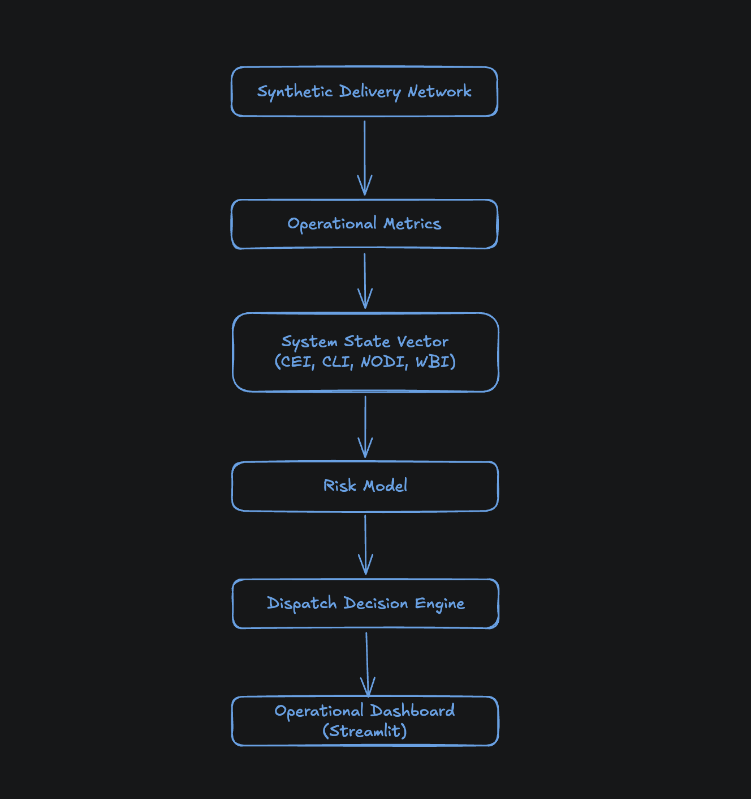
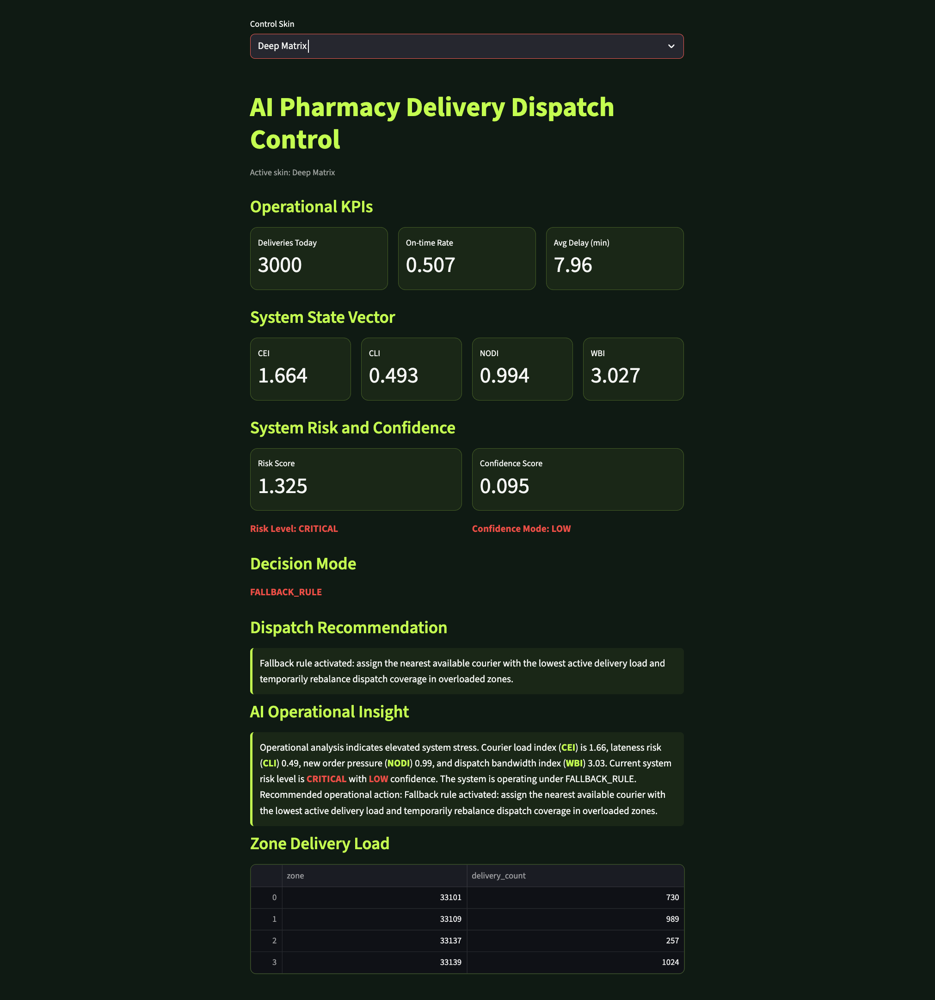
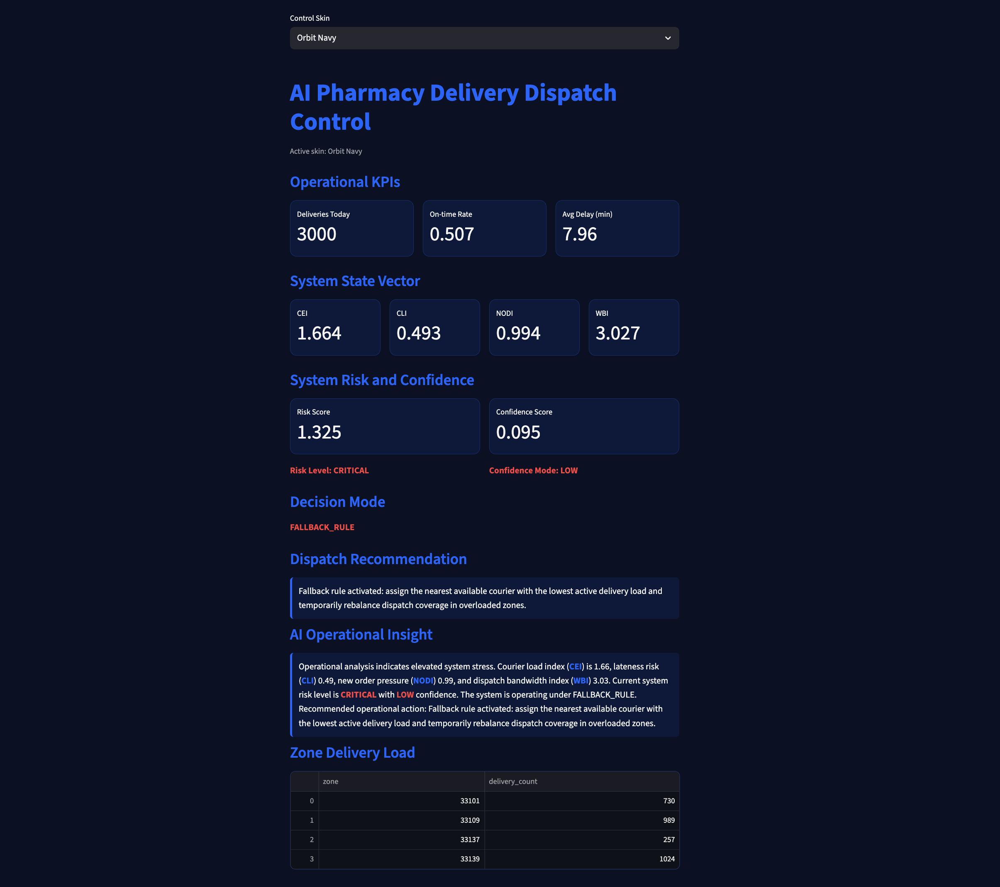
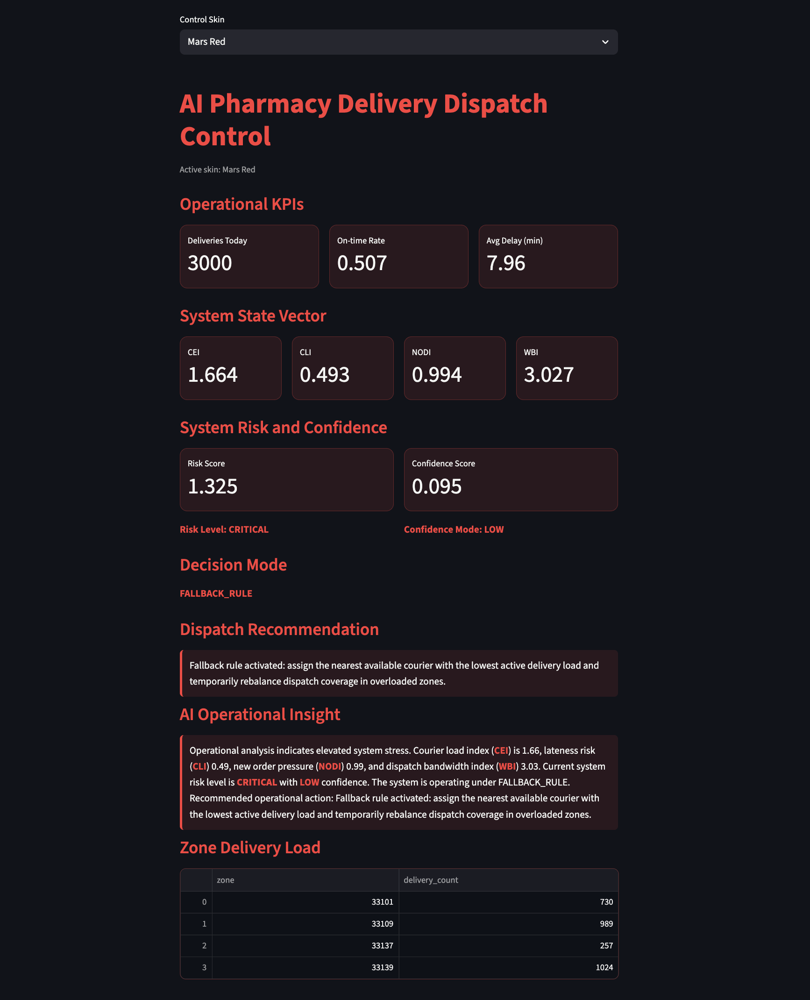
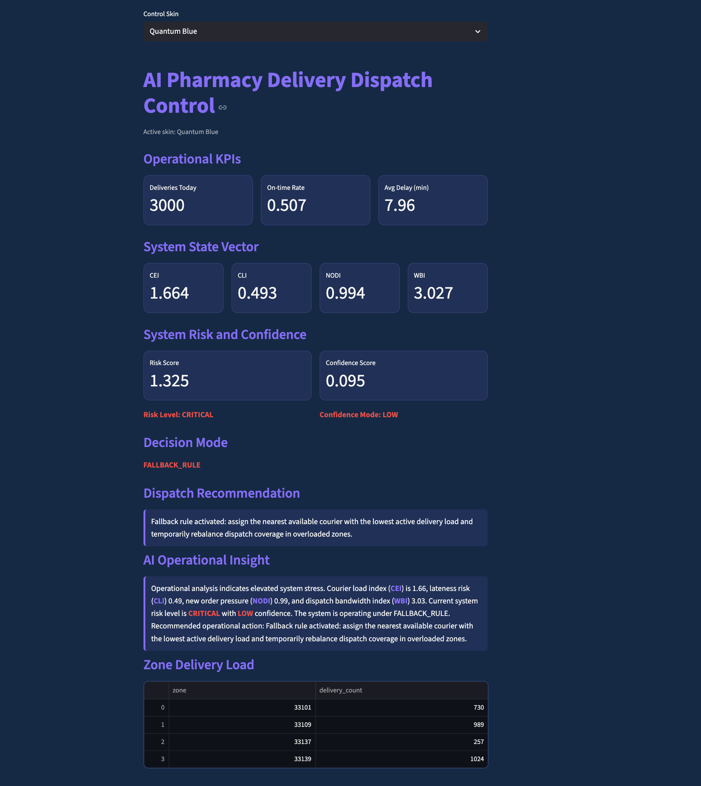

# AI Dispatch Decision System

Applied AI system that simulates and monitors a pharmacy delivery network and produces operational dispatch recommendations based on system state and risk evaluation.
The system demonstrates how operational analytics and AI-style reasoning layers can be combined to support logistics decision-making.

## Features

- Synthetic delivery network simulation
- Operational KPI monitoring
- System state vector (CEI, CLI, NODI, WBI)
- Risk scoring model
- Confidence evaluation model
- Dispatch decision engine
- AI operational insight generation
- Multi-theme interactive dashboard (Streamlit)


## System Overview
The system simulates a pharmacy delivery network and evaluates operational signals to detect system stress conditions and generate dispatch recommendations.

Operational signals are transformed into metrics, which form a system state vector.
The state vector feeds the risk model, confidence model, and decision engine, producing operational guidance displayed in the dashboard.


## Operational State Vector
The platform models operational conditions using four indices:
| Index | Meaning |
|------|---------|
| CEI | Courier Efficiency Index |
| CLI | Courier Lateness Index |
| NODI | New Order Demand Index |
| WBI | Workload Balance Index |

These indices represent the operational state of the delivery network and are used as inputs for risk and dispatch decision models.


## Risk Engine
The risk engine evaluates operational stress based on the system state vector.

Example output:
Risk Score: 1.325
Risk Level: CRITICAL

The model detects conditions such as:
- courier overload
- increased delivery delays
- dispatch bandwidth saturation

## Confidence Model
The confidence model estimates the reliability of operational signals.

Example:
Confidence Score: 0.095
Confidence Mode: LOW
Low confidence indicates unstable operational conditions or high variability in system signals.


## Dispatch Decision Engine
Based on risk and confidence evaluation the system activates a dispatch decision mode.

Possible modes:
| Mode | Description |
|-----|-------------|
| AI_RECOMMENDATION | AI generated dispatch guidance |
| AI_ADVISORY | advisory operational recommendation |
| FALLBACK_RULE | deterministic operational rule |

Example:
Decision Mode: FALLBACK_RULE

## Dispatch Recommendation
When fallback mode activates, the system recommends a safe operational rule:
Assign the nearest available courier with the lowest delivery load and rebalance dispatch coverage across overloaded zones.


## AI Operational Insight
The system generates an AI-style operational explanation summarizing system state and recommended actions.

Example:
Operational analysis indicates elevated system stress.

Courier load index (CEI) = 1.66  
lateness risk (CLI) = 0.49  
new order pressure (NODI) = 0.99  
dispatch bandwidth (WBI) = 3.03  

Current system risk level is CRITICAL with LOW confidence.

Recommended operational action: activate fallback dispatch rule.


## System Architecture

Synthetic Delivery Network
- Operational Metrics
- System State Vector
- Risk Model
- Confidence Model
- Dispatch Decision Engine
- AI Operational Insight
- Dashboard




## Dashboard
Interactive operational dashboard built with Streamlit.

Dashboard capabilities:
- operational KPI monitoring
- system state vector visualization
- risk and confidence evaluation
- dispatch recommendation engine
- AI operational insight panel
- zone delivery load monitoring
- multi-theme UI system

## Dashboard Preview
<p align="center">

</p>

### System State Vector
<p align="center">

</p>

### AI Operational Insight
<p align="center">

</p>

## Dashboard Themes
| Deep Matrix | Orbit Navy |
|-------------|------------|
|  |  |

| Mars Red | Quantum Blue |
|----------|--------------|
|  |  |


## Tech Stack

- Python
- Pandas
- NumPy
- Streamlit

## Project Structure
```
ai-pharmacy-dispatch-system
│
├── app
│   ├── main.py
│   ├── dashboard.py
│   └── themes.py
│
├── logic
│   ├── control_indices.py
│   ├── risk_engine.py
│   ├── confidence_engine.py
│   └── recommendation_engine.py
│
├── ui
│   └── styles.css
│
├── data
│
└── docs
    ├── dashboard.png
    ├── state-vector.png
    ├── ai-insight.png
    └── system_architecture.png
```

## Run

pip install -r requirements.txt  
streamlit run app/main.py

